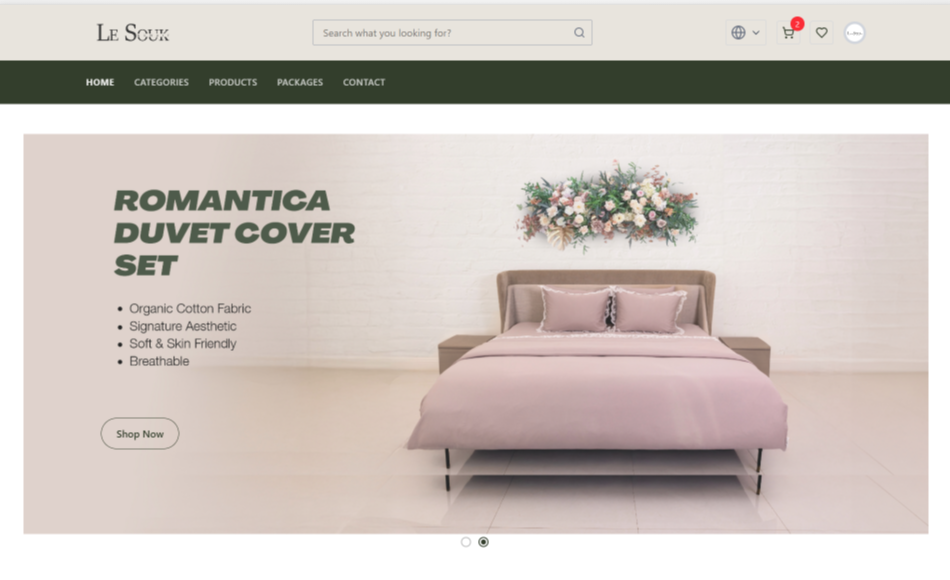

# Le Souk - React E-Commerce Platform



**Le Souk** is a comprehensive, full-featured e-commerce platform built with **React 19** and **Vite**, designed to provide a modern, fast, and user-friendly shopping experience. This project features both customer-facing shopping interfaces and a complete admin dashboard for store management.

Live Demo: [le-souk](https://le-souk.vercel.app/)

## Table of Contents
- [Features](#features)
- [Technologies Used](#technologies-used)
- [Project Structure](#project-structure)
- [Getting Started](#getting-started)
  - [Prerequisites](#prerequisites)
  - [Installation](#installation)
  - [Running the Project](#running-the-project)
- [Available Scripts](#available-scripts)
- [Key Features](#key-features)
- [Admin Dashboard](#admin-dashboard)
- [Internationalization](#internationalization)
- [Configuration](#configuration)
- [Contributing](#contributing)
- [License](#license)
- [Contact](#contact)

## Features

### Customer Features
- ** Complete Shopping Experience**: Product browsing, detailed product pages, shopping cart, and wishlist
- ** Package Management**: Special package deals and bundled products
- ** Advanced Search & Filtering**: Product search with filters and sorting options
- ** User Authentication**: Registration, login, password reset, and email verification
- ** Shopping Cart & Checkout**: Full cart management with secure checkout process
- ** Payment Integration**: Multiple payment methods with success/failure handling
- ** Responsive Design**: Fully responsive UI optimized for all devices
- ** Multi-language Support**: English and Arabic language support
- ** Product Reviews**: Customer review and rating system
- ** Order Management**: Order history and tracking for customers

### Technical Features
- ** Fast Performance**: Powered by Vite with Hot Module Replacement (HMR)
- ** Modern UI**: Built with Material-UI, Tailwind CSS, and Framer Motion
- ** State Management**: React Context API for global state management
- ** Data Fetching**: TanStack Query for efficient data fetching and caching
- ** Route Protection**: Protected routes for authenticated users and admin access
- ** SEO Optimized**: React Helmet for meta tags and SEO optimization
- ** Developer Tools**: ESLint configuration and development utilities

## Technologies Used

### Core Technologies
- **React 19**: Latest version of React with modern features
- **Vite 6**: Next-generation frontend tooling for fast development and builds
- **React Router DOM 7**: Client-side routing with lazy loading
- **JavaScript (ES6+)**: Modern JavaScript features

### UI & Styling
- **Material-UI (MUI) 7**: React component library for consistent design
- **Tailwind CSS 4**: Utility-first CSS framework
- **Framer Motion**: Animation library for smooth transitions
- **React Icons**: Comprehensive icon library
- **Slick Carousel**: Image and content carousels

### State Management & Data
- **React Context API**: Global state management for auth, cart, wishlist, etc.
- **TanStack Query**: Data fetching, caching, and synchronization
- **Axios**: HTTP client for API requests

### Internationalization
- **i18next**: Internationalization framework
- **react-i18next**: React integration for i18next
- **i18next-browser-languagedetector**: Automatic language detection

### Development & Build Tools
- **ESLint**: Code linting and quality assurance
- **Vite Plugin Compression**: Asset compression for production builds
- **React Hot Toast**: Toast notifications
- **SweetAlert2**: Beautiful alert dialogs

### Additional Libraries
- **Canvas Confetti**: Celebration animations
- **React Slick**: Carousel components
- **Recharts**: Data visualization for admin dashboard
- **React Spinners**: Loading indicators
- **Browser Image Compression**: Image optimization

## Project Structure

```
le-sock/
├── src/
│   ├── components/          # Reusable UI components
│   │   ├── CustomCursor/    # Custom cursor component
│   │   ├── Footer/          # Footer components
│   │   ├── Home Components/ # Home page specific components
│   │   ├── Language/        # Language switcher
│   │   ├── Meta/            # SEO meta components
│   │   ├── Navbar/          # Navigation components
│   │   └── ...
│   ├── context/             # React Context providers
│   │   ├── Auth/            # Authentication context
│   │   ├── Cart/            # Shopping cart context
│   │   ├── Language/        # Language context
│   │   ├── Settings/        # App settings context
│   │   ├── User/            # User profile context
│   │   └── WishList/        # Wishlist context
│   ├── dashboard/           # Admin dashboard
│   │   ├── components/      # Dashboard components
│   │   ├── hooks/           # Dashboard-specific hooks
│   │   ├── layouts/         # Dashboard layouts
│   │   └── pages/           # Dashboard pages
│   ├── hooks/               # Custom React hooks
│   ├── layouts/             # Main app layouts
│   ├── locales/             # Internationalization files
│   │   ├── ar/              # Arabic translations
│   │   └── en/              # English translations
│   ├── pages/               # Main application pages
│   │   ├── Auth/            # Authentication pages
│   │   ├── Cart/            # Shopping cart page
│   │   ├── CheckOut/        # Checkout process
│   │   ├── Products/        # Product pages
│   │   ├── Profile/         # User profile pages
│   │   └── ...
│   ├── routes/              # Routing configuration
│   ├── utils/               # Utility functions
│   └── assets/              # Static assets
├── public/                  # Public static files
├── dist/                    # Production build output
└── ...
```

## Getting Started

Follow these steps to set up and run the project locally.

### Prerequisites
- **Node.js**: Version 18.x or higher
- **npm** or **yarn**: Package manager for installing dependencies
- A modern web browser (e.g., Chrome, Firefox, Safari, Edge)

### Installation
1. Clone the repository:
   ```bash
   git clone https://github.com/3b3zeem/le-souk-react.git
   ```
2. Navigate to the project directory:
   ```bash
   cd le-souk-react
   ```
3. Install dependencies:
   ```bash
   npm install
   # or
   yarn install
   ```

### Running the Project
1. Start the development server:
   ```bash
   npm run dev
   # or
   yarn dev
   ```
2. Open your browser and visit `http://localhost:5173` to see the application in action.

## Available Scripts

- `npm run dev` - Start the development server
- `npm run build` - Build the project for production
- `npm run preview` - Preview the production build locally
- `npm run lint` - Run ESLint to check code quality

## Key Features

### E-Commerce Functionality
- **Product Catalog**: Browse products with categories, filters, and search
- **Product Details**: Detailed product pages with images, descriptions, and reviews
- **Shopping Cart**: Add/remove items, quantity management, and cart persistence
- **Wishlist**: Save favorite products for later purchase
- **Order Management**: Complete order tracking and history
- **Package Deals**: Special bundled product offerings

### Authentication & Security
- **User Registration**: Account creation with email verification
- **Secure Login**: JWT-based authentication
- **Password Reset**: Email-based password recovery
- **Route Protection**: Protected routes for authenticated users
- **Admin Access**: Separate admin dashboard with role-based access

### User Experience
- **Responsive Design**: Mobile-first approach with Tailwind CSS
- **Smooth Animations**: Framer Motion for engaging interactions
- **Loading States**: Skeleton loaders and spinners
- **Toast Notifications**: User feedback with React Hot Toast
- **Custom Cursor**: Enhanced cursor interactions

### Internationalization
- **Multi-language Support**: English and Arabic
- **RTL Support**: Right-to-left layout for Arabic
- **Language Detection**: Automatic browser language detection
- **Dynamic Content**: All text content is translatable

## Admin Dashboard

The application includes a comprehensive admin dashboard with the following features:

### Dashboard Overview
- **Analytics**: Sales metrics, user statistics, and performance charts
- **Quick Actions**: Fast access to common admin tasks

### Management Features
- **User Management**: View and manage user accounts
- **Product Management**: Add, edit, and delete products
- **Category Management**: Organize products into categories
- **Package Management**: Create and manage product packages
- **Order Management**: Process and track customer orders
- **Review Management**: Moderate customer reviews
- **Coupon System**: Create and manage discount coupons
- **Settings**: Configure site-wide settings
- **Hero Section**: Manage homepage banners and promotions
- **Payment Settings**: Configure payment methods
- **Shipping Settings**: Set up shipping options and rates
- **Country Management**: Manage available countries for shipping

## Internationalization

The application supports multiple languages with a complete i18n setup:

- **Supported Languages**: English (en) and Arabic (ar)
- **Translation Files**: Located in `src/locales/`
- **Language Switching**: Dynamic language switching without page reload
- **RTL Support**: Proper right-to-left layout for Arabic
- **Fallback Language**: English as the default fallback

## Configuration

### Vite Configuration
- **Development Server**: HMR enabled with overlay
- **Build Optimization**: Brotli compression for production
- **Asset Handling**: Optimized for images and static files

### ESLint Configuration
- **Code Quality**: Enforces consistent coding standards
- **React Hooks**: Proper hooks usage validation
- **Modern JavaScript**: ES6+ features support
- **Custom Rules**: Project-specific linting rules

### Vercel Deployment
- **SPA Routing**: Proper handling of client-side routing
- **Build Environment**: Optimized build settings
- **Asset Optimization**: Compressed assets for faster loading

## Contributing

Contributions are welcome! To contribute to this project:

1. **Fork the repository** on GitHub
2. **Clone your fork** locally:
   ```bash
   git clone https://github.com/your-username/le-souk-react.git
   cd le-souk-react
   ```
3. **Create a new branch** for your feature:
   ```bash
   git checkout -b feature/your-feature-name
   ```
4. **Make your changes** and ensure they follow the project's coding standards
5. **Run the linter** to check for any issues:
   ```bash
   npm run lint
   ```
6. **Test your changes** thoroughly
7. **Commit your changes** with a descriptive message:
   ```bash
   git commit -m "Add: your feature description"
   ```
8. **Push to your fork**:
   ```bash
   git push origin feature/your-feature-name
   ```
9. **Open a Pull Request** on GitHub

### Development Guidelines

- Follow the existing code style and patterns
- Ensure all ESLint rules pass
- Write meaningful commit messages
- Test your changes thoroughly
- Update documentation if needed
- Consider internationalization for new text content

## License

This project is open source and available under the [MIT License](LICENSE).

## Contact

For questions, feedback, or support, reach out to the project maintainer:

- **GitHub**: [3b3zeem](https://github.com/3b3zeem)
- **Email**: [Ahmed Mostafa](mailto:ahmedmostafaabdel3azem@gmail.com)
- **Live Demo**: [le-souk.vercel.app](https://le-souk.vercel.app/)

---

**Built with ❤️ by [3b3zeem](https://github.com/3b3zeem)**

*Le Souk - Your one-stop shop for quality and style*